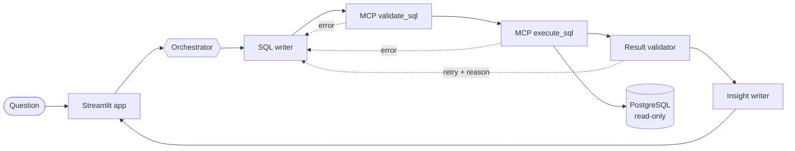

# AI Data Analyst Agent

Ask business questions in plain English. A team of Claude agents writes the SQL, checks it, runs it
through a read-only **MCP server** on PostgreSQL, and explains the answer with a chart and a PDF report.


**Live demo:** _add link_ · **Demo video:** _add link_

**Case study (PDF):** [Read the full case study](docs/case_study.pdf)

<!-- Add a GIF here: docs/demo.gif -->

---

## What it does

> **You:** What was monthly revenue in 2025?
>
> **Agent:** Revenue peaked in December 2025 at about $1.0M, roughly double the monthly average...
> *(plus a line chart, the result table, the exact SQL, and a step-by-step trace of how the agents got there)*

- Plain-English questions over a 6-table e-commerce database (orders, customers, products, returns)
- **Self-correcting:** database errors and validator objections are fed back to the SQL writer (up to 3 attempts)
- **Transparent:** every answer shows its SQL and the full agent trace
- **Safe:** three independent layers make writes and unsafe queries impossible
- **Follow-up questions** that remember context ("now split that by channel")
- Charts chosen automatically; **PDF, Markdown and CSV** downloads
- **Agent Skills:** one-click Monthly Sales Report and Data Quality Check
- **Evaluation harness:** 30 questions with gold SQL; measures accuracy, attempts, latency and cost

## Architecture



Details, components and the safety design: [docs/architecture.md](docs/architecture.md).

| MCP tool | Purpose |
|---|---|
| `get_db_schema` | Tables, columns, types, descriptions, foreign keys |
| `get_sample_rows` | Example rows to show value formats |
| `validate_sql` | Safety rules + Postgres `EXPLAIN`, without running the query |
| `execute_sql` | Runs one read-only SELECT (1,000-row cap, 30 s timeout) |
| `data_quality_check` | NULLs, duplicates, orphan records, invalid values |

## Evaluation

30 questions (12 easy, 10 medium, 8 hard) with hand-written gold SQL. Both queries are executed and
their **results** compared (column names, extra columns, row order and rounding don't matter).

```bash
python -m evaluation.run_eval --compare
```

Results from the run on 2026-09-29 (`evaluation/results/run_20260929_1531.md`):

| Metric | Validator OFF | Validator ON |
|---|---|---|
| Execution accuracy (strict, automatic) | **93.3%** (28/30) | **93.3%** (28/30) |
| Easy / Medium / Hard | 100 / 90 / 87.5 % | 100 / 100 / 75 % |
| Avg attempts per question | 1.00 | 1.07 |
| Median seconds per question | 2.6 | 3.6 |
| Avg tokens per question | 2,980 | 4,391 |

**Manual review of the 4 failures:** all four queries were logically correct but returned a different
*layout* than the gold query, which the automatic comparison counts as wrong:

- quarterly revenue labelled `2024-Q1` instead of a quarter start date,
- average order value by segment returned *wide* (one row per segment with 2024 and 2025 columns)
  instead of *long* (one row per segment and year) - failed in both runs,
- new customers per month returned all 12 months including zero-count months instead of only
  months with new customers.

**What this shows:** the result-validation agent fixed one question and changed another, so accuracy
stayed the same while it cost about 40% more time and 47% more tokens. On this benchmark it isn't worth
its cost, so it's a toggle in the app. The 93.3% strict score is reported as the headline number
rather than adjusting the test after seeing the results.

## Quick start

Requirements: Python 3.11+, Docker, an Anthropic API key.

```bash
git clone https://github.com/kovinaveenkumar/ai-data-analyst-agent.git
cd ai-data-analyst-agent
python -m venv .venv
source .venv/bin/activate            # Windows: .venv\Scripts\activate
pip install -r requirements.txt
cp .env.example .env                 # then add ANTHROPIC_API_KEY

docker compose up -d postgres        # schema + seed data + read-only role, automatically
python -m scripts.check_setup        # checks DB, MCP and Claude; tells you what to fix

python -m analyst.mcp_server.server  # terminal 1
streamlit run app/main.py            # terminal 2 -> http://localhost:8501
```

Prefer one terminal? Set `MCP_MODE=inprocess` in `.env` and skip the MCP server command.

## Tests

```bash
python -m pytest
```

59 tests, no API key needed (agents use a scripted LLM): SQL safety rules, database read-only
enforcement, every MCP tool through the real MCP client, the self-repair loop, the evaluation
comparator, charts and PDF reports. CI runs them against a real Postgres on every push.

## Use it from Claude Code

`.mcp.json` registers the server as `analytics`. Open the folder in Claude Code and ask questions
directly; the Agent Skills in `skills/` work there too.

## Project structure

```
analyst/
  agents/          orchestrator, SQL writer, result validator, insight writer, context
  mcp_server/      MCP server (MCPServer, Streamable HTTP / stdio) and tool implementations
  knowledge/       business rules and few-shot examples
  sql_safety.py    AST-based SQL validation
  db.py            read-only execution with timeout and row cap
  llm.py           Claude wrapper (structured output, token tracking)
  charts.py, report.py, skills_runner.py
app/main.py        Streamlit UI
db/init/           schema, deterministic seed data, read-only role
evaluation/        30-question benchmark, comparator, runner, results
skills/            Agent Skills: monthly-sales-report, data-quality-check
tests/             pytest suite
docs/              architecture, data dictionary, decisions, deployment, demo script
```

## Tech stack

Python · Claude API (`anthropic`) · MCP Python SDK v2 · PostgreSQL 16 · psycopg 3 · sqlglot ·
Streamlit · Plotly · fpdf2 · pytest · Docker Compose · GitHub Actions

## Roadmap

- Snowflake as a second backend
- Ask a clarifying question when a request is ambiguous
- Retrieve only relevant tables for large schemas
- User authentication and per-user query budgets

---

Built by **Naveen Kumar Kovi** · [LinkedIn](https://www.linkedin.com/in/kovinaveenkumar)
