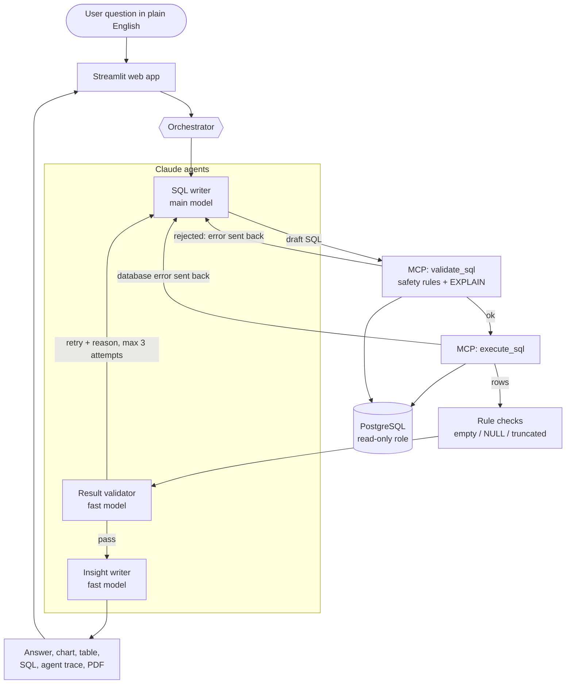

# Architecture

A question travels from the web app through three specialist agents and a read-only MCP
server to PostgreSQL. Nothing touches the data except through the MCP safety layer.

## Components

| Component | File | What it does |
|---|---|---|
| Web app | `app/main.py` | Chat UI, charts, tables, SQL view, agent trace, PDF/Markdown/CSV downloads, reports, data-quality tab |
| Orchestrator | `analyst/agents/orchestrator.py` | Runs the loop, feeds errors back, stops after `MAX_ATTEMPTS`, records every step and token |
| SQL writer | `analyst/agents/sql_agent.py` | Schema + business rules + examples + question (+ earlier feedback) -> one SELECT |
| Result validator | `analyst/agents/validator.py` | Free rule checks, then a Claude review: does the result answer the question? |
| Insight writer | `analyst/agents/insight_agent.py` | Headline, summary, key points, chart choice, follow-up questions |
| MCP server | `analyst/mcp_server/server.py` | `get_db_schema`, `get_sample_rows`, `validate_sql`, `execute_sql`, `data_quality_check` |
| MCP client | `analyst/mcp_client.py` | Streamable HTTP (production) or in-process (tests/eval), same protocol either way |
| Safety rules | `analyst/sql_safety.py` | sqlglot AST checks: single SELECT, allowed tables, banned functions, LIMIT |
| Agent Skills | `skills/*/SKILL.md` | Monthly Sales Report and Data Quality Check; usable in the app and in Claude Code |
| Evaluation | `evaluation/` | 30 questions with gold SQL, result-set comparison, accuracy / latency / cost |

## Three layers of SQL safety

1. **Database role** (`db/init/03_readonly_role.sql`): `analyst_ro` has SELECT only and
   `default_transaction_read_only = on`. Even a query that slipped past everything else cannot write.
2. **Static validation** (`analyst/sql_safety.py`): the SQL is parsed into a syntax tree; anything
   other than one SELECT on the six analytics tables is rejected before it reaches the database,
   including multi-statement tricks, `SELECT INTO`, `FOR UPDATE`, `pg_sleep`, `dblink`, system catalogs.
3. **Runtime guard** (`analyst/db.py`): read-only transaction, 30-second statement timeout,
   1,000-row cap.

Tests cover all three (`tests/test_sql_safety.py`, `tests/test_database_readonly.py`).

## Why structured output through a forced tool

Each agent returns JSON (e.g. `{"sql": ..., "reasoning": ...}`). The wrapper in `analyst/llm.py`
gives Claude one tool whose input schema is the desired output and forces it with `tool_choice`.
The tool never runs; its input is the answer. That makes parsing reliable without regex.
